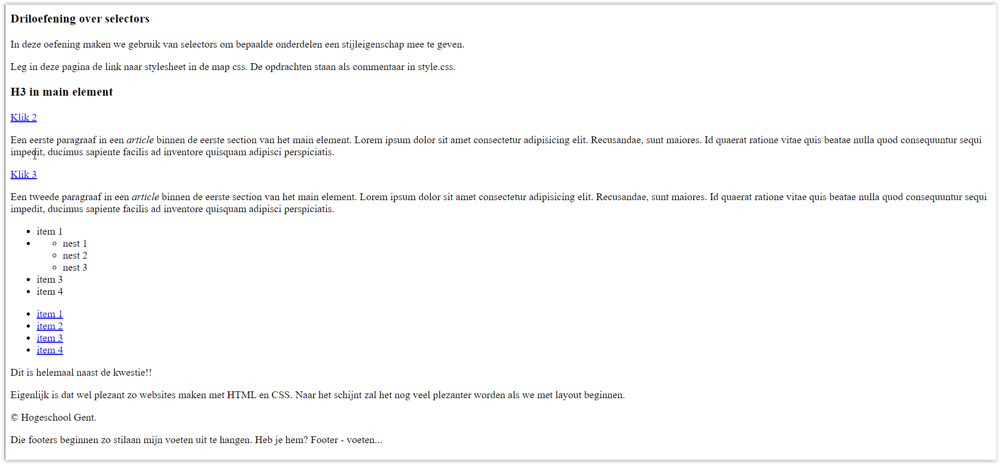
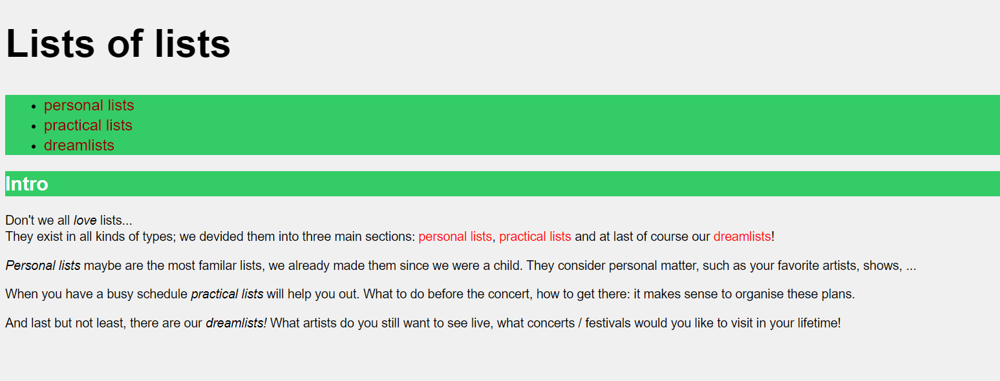

# Oefeningen hoofdstuk 2: CSS

Download of clone deze repository. Hiervoor klik je op de groene knop.

Pak deze zip uit in de map waar je alle leermateriaal van Webapplicaties I plaatst.

Ga nu naar Visual Studio Code en open deze map.

Er is 1 driloefening (met drie kleinere oefeningen) en vervolgens 3 grotere oefeningen, waarvan de laatste twee, Vander Beken en Yoko's kitchen verder werken op de overeenkomstige oefeningen van het vorige hoofdstuk.

## OEFENING 1: het betere drilwerk.
De eerste oefening bevat 3 kleine oefeningen om de juiste selectors te gebruiken en stijlregels te declareren.

Je vindt de oefeningen in de map **driloefeningen**.

Je start in elke oefening met dezelfde index.html. De map css bevat de style.css. 
In het css bestand vind je de opdrachten die je moet uitvoeren, misschien vind je ook nuttige tip(s) in de webpagina zelf.

Hieronder zie je het resultaat in de browser zonder css en de resultaten van de drie oefeningen met css.

Zonder CSS.

Oefening 1.

Oefening 2.

Oefening 3.

----
## OEFENING 2: Lijsten

Open de map **Lijsten**:
- vertrek van de gegeven tekstbestanden en maak de pagina na op basis van onderstaande screenshot. Denk na over de semantiek en over de opmaak.
- maak een afzonderlijk CSS-bestand met de naam main.css in een folder CSS en verwijs er naar in het HTML-bestand.
- volgende kleuren worden gebruikt: #f0f0f0 - red - darkred - #33CC66 - white - yellow
- gebruikte font: helvetica, verdana, sans-serif;
- grootte lettertype: 1.3 keer de normale grootte - h1: 4X - h2: 2X - menu_item: 1.6X

Werk daarna ook de pagina’s personal.html, dream.html en practical.html uit op basis van onderstaande screenshots.

**personal.html**

**practical.html**

**dream.html

---

## OEFENING 3: Vander Beken.

Deze oefening gaat verder op de oplossing van dezelfde oefening van het vorige hoofdstuk.

- Open in Visual Studio Code de map VanderBeken.
- Maak een extra map aan voor de stylesheet
    - map CSS
    - Bestand: main.css
- Voeg een resetting stylesheet toe en importeer deze in de main stylesheet
- Kies en importeer een sans-serif font van https://fonts.google.com in de main stylesheet

### **Toevoegen van de stylesheet en font**
Begin met het definiëren van de algemene font voor de website, pas de main.css aan
- gebruik de body selector
- definieer de Google font aan de hand van de font-family
- link de main.css in al onze webpagina’s

Vergeet niet de stylesheet overzichtelijk te houden aan de hand van commentaar regels.

De homepage ziet er nu als volgt uit:

### **Toevoegen van een achtergrond**

Laten we nu een achtergrond image op onze website integreren
- Gebruik de aparte properties of de korte notatie
    1. achtergrond kleur: #f2f2f2
    2. achtergrond image: body_bg.png
    3. de achtergrond mag herhaald worden
    4. achtergrond image mag beginnen vanaf de linkerbovenhoek van onze website

  

### **Opmaak navigatie**

De navigatie maken we ook wat duidelijker
- Zorgen voor een border die enkel onderaan de navigatie te zien is (google zelf op css - border, wordt later in detail besproken):
    1. 1px dik
    2. Gestreept
    3. Kleur #bfc2fb
- Alle elementen van onze lijst:
    1. 1.2 em groot
    2. 1.2 em regel grootte
- De links willen we als volgt:
    1. Geen onderlijning
    2. Algemene kleur: #979797
    3. Bij hover kleur: #636b67
    4. De huidige paginalink: red (tip voeg een klasse toe)

 

### **Opmaak main content**

We willen enkele woorden op onze homepagina benadrukken
- 1.2em regelgrootte voor alle tekst
- Voorzie de volgende woorden op de index pagina van een rode kleur (gebruik een element selector hiervoor)
    1. Jarenlange ervaring
    2. (kleur)advies op maat
    3. Duidelijke afspraken
    4. Kwaliteit en duurzaamheid
- H1 elementen willen we ook nog wat nadruk op leggen
    1. De vette versie van ons lettertype
    2. Een regelgrootte van 2em
    3. Tekst grootte van 1.2em

 

### **Opmaak footer content**
Ook de footer op de “Over ons” willen we nog wat extra’s geven.
- Rode achtergrond
- Witte text
- Witte links zonder onderlijning
- H1 met een 1.5em regelgrootte

 

---
## Oefening 4: Yoko's kitchen

Deze oefening gaat verder op de oplossing van dezelfde oefening van het vorige hoofdstuk.

- Open in Visual Studio Code de map Yoko.
- De stylesheet staat reeds in de map css: site.css.

**Zonder CSS**

 

**Richtlijnen:**
1. Voeg een bestand site.css in de juiste folder toe en verwijs er naar in het html bestand
3. De gebruikte kleuren zijn:
a. #666666: kleur tekst
b. #aeaca8: grijs
c. #de6581: roze
4. Gebruik een sans serif lettertype: Verdana als eerste, vervolgens Arial en ten slotte het
standaard sans-serfif lettertype.
5. Gebruik voor de eenheden relatieve eenheden.
6. De lijnhoogte is voor de ganse pagina: 1.5X de normale lijnhoogte.
7. h1, h2, h3 hebben een groote die resp. 1.5 – 1.3 – 1.1X groter zijn dan normaal. h2 ziet er
vettig uit.
8. de figcaption is links gealligneerd en 0.9X de normale lettergrootte.
9. Hypelinks worden niet onderstreept, zijn zwart en worden #de6581; bij het hoveren. De
huidige pagina wordt wit weerggegeven als hyperlink.
10. De menu mag geen lijstaanduiding vertonen (geen bollekes).
11. Adressen en hyperlinks binnen section zijn maar 0.8X de normale grootte.

**Eindresultaat**

 
